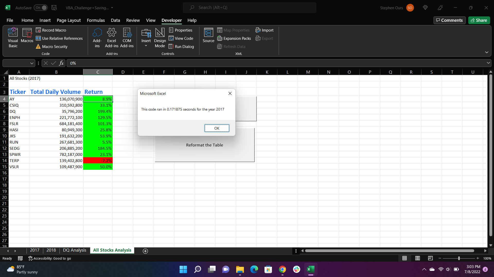

# Green Stocks with VBA – Refactoring Code
##Overview of Project
###Purpose and background
This project started with a script that analyzed the performance of twelve selected green energy stocks in the years 2017 and 2018. The original objective was to summarize the trading volume and change in value of each stock, in order to guide a reader toward a reasonable decision regarding which stocks would be suitable for future investment. From there, the challenge became to refactor the existing script to operate without its nested “for” loops, which were causing the system to read every row of the data sheet twelve times. By streamlining that section, it became possible to attain the same results substantially more quickly.

##Results
### Comparison of stock performance between 2017 and 2018
In general, the selected stocks tended to perform better in 2017 than in 2018. In 2017, eleven of the stocks posted a positive return,  with TERP being the only exception.  Even then, TERP’s return of -7.21% was a relatively modest loss compared to some of the performances in 2018. The tickers DQ, ENPH, FSLR, and SEDG all had returns of above 100% in 2017. By contrast, only ENPH and RUN posted positive returns in 2018 , whereas the other ten stocks had returns ranging from -3.54% to -62.60%. Only ENPH and TERP improved their returns in 2018, and TERP still had a negative 2018 return. 

### Execution times of original versus refactored script
The refactored script was executed considerably more quicky than the original, even when considering only the segments of the original that produced the volume and return data. For 2017, it took the original script 0.5 seconds to produce the volume and return data, without completing the conditional formatting of the Return column.  By contrast, the refactored code completed the same operations, and formatted the column, in 0.17 seconds.  

Similarly, the original script was slower without completing the formatting for the 2018 data. The original script ran in 0.7 seconds to produce only the numerical data. 
  
The refactored script ran in 0.19 seconds, and produced the same data along with conditional formatting.  
In both cases, the key to the increased speed was the removal of this block from the original code:
```
For i = 0 To 11
        Worksheets(yearValue).Activate
        'Find ticker number "i"
        ticker = tickers(i)
        totalVolume = 0
        
        'On every available row...
        For j = 2 To rowEnd
        'Add up that ticker's total volume
            If Cells(j, 1).Value = ticker Then
                totalVolume = totalVolume + Cells(j, 8).Value
            End If
            
        'Identify starting price
            If Cells(j, 1).Value = ticker And Cells(j - 1, 1).Value <> ticker Then
                startingPrice = Cells(j, 6).Value
            End If
            
        'identify ending price
            If Cells(j, 1).Value = ticker And Cells(j + 1, 1).Value <> ticker Then
                endingPrice = Cells(j, 6).Value
            End If
        
        Next j
```
And its replacement with this refactored selection, which determined the same values:
```
For i = 2 To RowCount
    
        '3a) Increase volume for current ticker
        tickerVolumes(tickerIndex) = tickerVolumes(tickerIndex) + Cells(i, 8).Value
        
        '3b) Check if the current row is the first row with the selected tickerIndex.
        'If  Then
        If Cells(i, 1).Value = tickers(tickerIndex) And Cells(i - 1, 1).Value <> tickers(tickerIndex) Then
        
            tickerStartingPrices(tickerIndex) = Cells(i, 6).Value
            
        'End If
        End If
        
        '3c) check if the current row is the last row with the selected ticker
         'If the next row’s ticker doesn’t match, increase the tickerIndex.
        'If  Then
        If Cells(i, 1).Value = tickers(tickerIndex) And Cells(i + 1, 1).Value <> tickers(tickerIndex) Then
        
            tickerEndingPrices(tickerIndex) = Cells(i, 6).Value
            
            '3d Increase the tickerIndex.
            tickerIndex = tickerIndex + 1
            
        'End If
        End If
        
        Next i
```
##Summary
### General information about refactoring
Broadly speaking, the notion of refactoring provides a way to streamline code. This could be beneficial by making it easier for an outside party to read and understand the code, making the code more flexible in case the underlying data is changed or expanded, or in this case, allowing the code to execute more quickly. Possible problems would mostly stem from the refactoring being done carelessly, which could introduce logic errors or leave the new code with fragments from the earlier program which are no longer useful or desirable. It is also imperative to use comments and descriptive names if different people are doing the original and the refactoring, so that the flow and output of the program remains the same in both versions.

### Pros and cons of the refactored code in this specific case
The refactored code in this case had the clear advantage of being faster to execute. It also may be easier for a new user to read, because it does not contain nested “for” loops in the way that the original did. For this particular project, the refactored script initially returned an error, which was related to some of the arrays being treated as if they held 13 tickers even though the data contained only 12. One other drawback to the refactored code is that it does not explicitly check every line for every ticker symbol. This isn’t necessarily a problem in the current setting, where the datasets are sorted by ticker, but could lead to some “volume” entries or price changes being missed if the data had been out of order. Additionally, both versions rely on the original data being properly sorted by date, because they identify the starting and ending prices as first and last in the list, rather than comparing the actual values in the “date” column.
